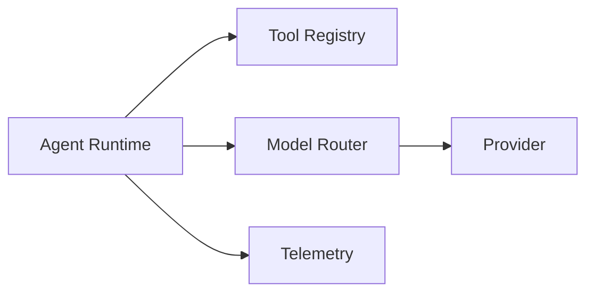

# Ax Agent Core

Production-grade agentic AI core for tool-augmented agents with an MCP-ready interface layer.

## Features
- Tool registry + execution with schema validation, retries, timeouts
- Provider routing with fallback (MockProvider + OpenAIProvider stub)
- Conversation state + in-memory memory store
- Cost tracking interface (token/cost estimation stub)
- Structured logs + optional OpenTelemetry hooks

## Architecture


## Quickstart
```bash
python -m venv .venv
source .venv/bin/activate
pip install -e .
ax-agent run-demo
```

## CLI
```bash
ax-agent run-demo
ax-agent list-tools
ax-agent validate-config --config examples/config.json
```

## Examples
- `examples/demo.py`
- `examples/sample_prompts.txt`

## Development
```bash
pip install -e .[dev]
pytest
```

## Notes
- `OpenAIProvider` is a stub to illustrate provider wiring.
- Demo tool invocation format: `tool:<name> {json}`
